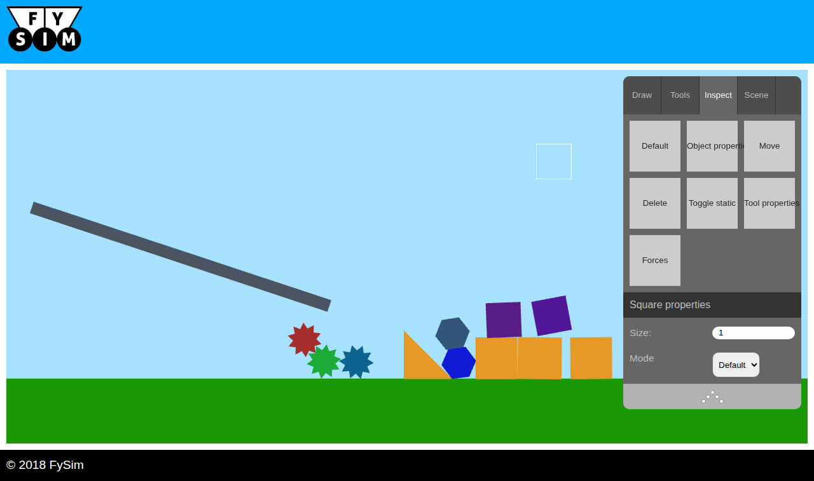

# FySim

A 2D rigid-body physics engine and simulation tool, written from scratch in
JavaScript and WebGL. Built January-May 2018 as a bachelor thesis at the
University of Stavanger: *Simulating Classical Mechanics on a Web Platform*
(`docs/`).

The thesis was done with a classmate: they built the web platform, I built the
physics simulator. Their front-end is still here, because the tool runs inside
it - `web/gui_static/`, `web/_static/`, and `jML.js` and `init.js` in
`web/sim_static/`. Everything else under `web/sim_static/` is mine. Their Flask
and MySQL back end is gone, replaced by `serve.py`.



## Running it

No dependencies, no build step. Python 3 and a browser with WebGL:

```sh
python3 serve.py
```

Then open <http://127.0.0.1:8000/>. Saved scenes go to `scenes.db` next to
`serve.py`; delete it to start clean.

## Using it

Four tabs on the right: **Draw** spawns squares, discs, gears and free-form
polygons; **Tools** attaches hinges, ropes and pulleys; **Inspect** reads and
writes live properties and shows force vectors; **Scene** freezes, pauses, saves
and loads.

To draw a polygon, left-click each corner (running angle and length show at the
cursor), right-click to undo one, Enter to close the shape.

## The engine

In `web/sim_static/`:

- `physics_engine/` - the core. Collision is defined over the interval between
  ticks rather than at an instant, so a body moving fast between two frames is
  still caught. Pair-finding is an O(n^2) loop rejected by an axis-aligned
  bounding box test; collision groups carry contact state across ticks so
  resting stacks settle instead of jittering.
- `physics_engine/collision_box_handeler/` - an abandoned optimisation. A sorted
  structure meant to get pair-finding below O(n^2), but measuring showed its
  constant-factor overhead lost to the plain bounding box loop at realistic
  object counts, so it is not wired in. Kept because it is part of the thesis.
- `physics_engine/polygon/` - arbitrary polygons with holes; area, centre of
  mass and moment of inertia derived from the geometry.
- `graphics/` - a small WebGL renderer, plus a debug pass for force vectors and
  collision boxes.
- `utilities/` - vector and column-major 3x3 matrix maths, a seeded RNG (the
  simulation is deterministic), linked list and queue.
- `physics_simulator.js` - the public API. `how_to_use.txt` beside it is the
  reference, written at the time so the GUI could be built against it.

It needs a `<canvas>` and nothing else:

```js
var ps = new PhysicsSimulator(document.getElementById('canvas'));
ps.setModeCustomShapeSpawner();
ps.setCustomShape(PhysicsSimulator.DISC);
```

`web/local/boot.js` builds the starter scene against that same API.

## Hosting it

Upload `web/`. That is the whole deployment - static files, no Python and no
database on the server, working at a domain root, a subdomain or any
subdirectory. Scenes then save to the visitor's browser instead of SQLite;
`web/local/` holds the three small scripts that make that work.

`serve.py` is for local development only: single process, no TLS, and its scene
endpoints are open to anyone who can reach it.

## Layout

```
serve.py       local dev host: static files plus a small scene API, stdlib only
web/           the deployment
  local/       written to run this without the original server
  sim_static/  the engine and renderer (mine), the tool GUI (my classmate's)
  gui_static/  shared widgets       (my classmate's)
  _static/     framework and styles (my classmate's)
docs/          the thesis and the screenshot
```

The 2018 files are unedited. Eight dead ones were removed: the client-side
router and its library, the original entry point, a stale page and test page
referencing files deleted years ago, and two unused test shaders.
